<div align="center">
    <h1 align="center"><a href="https://github.com/hhftechnology/middleware-manager-traefik">Traefik/Pangolin Middleware Manager</a></h1>

[](https://hub.docker.com/r/hhftechnology/middleware-manager)

[](https://discord.gg/HDCt9MjyMJ)

</div>

<h3 align="center">Comprehensive Middleware, Router, and Service Management for Traefik</h3>

<div align="center">
  <h5>
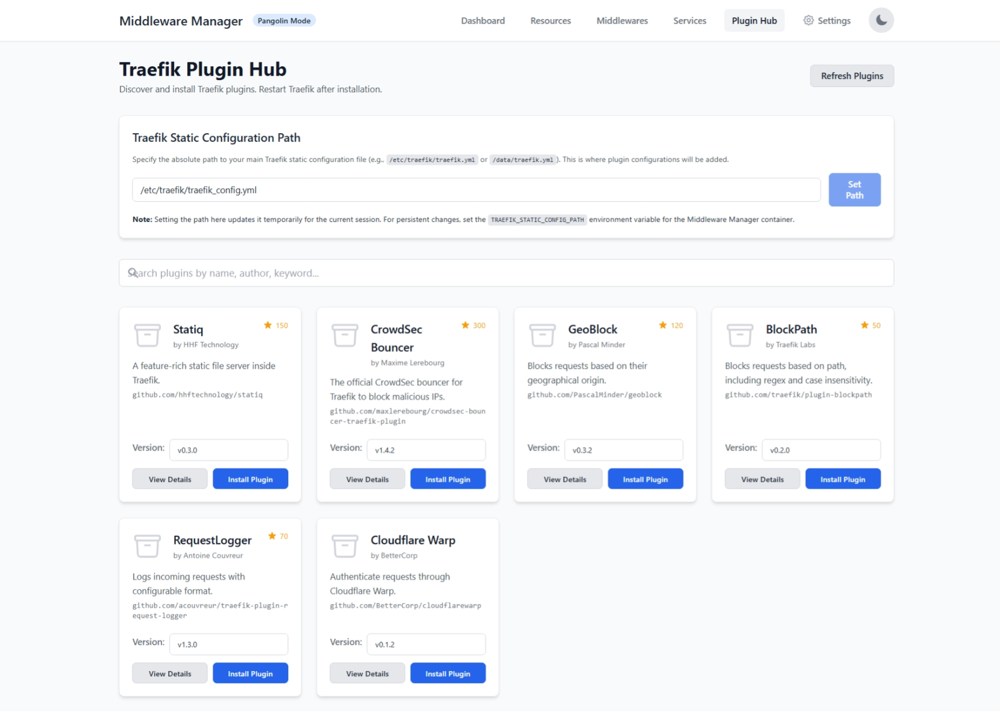  
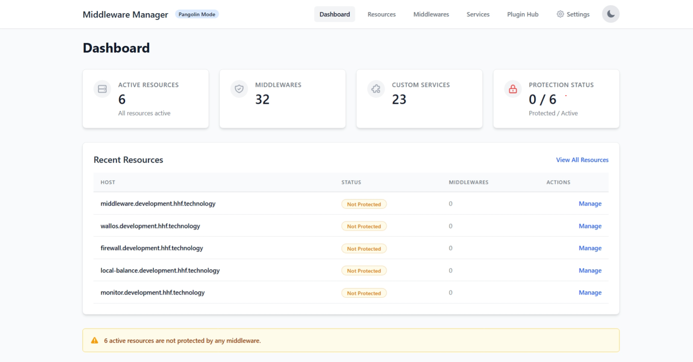
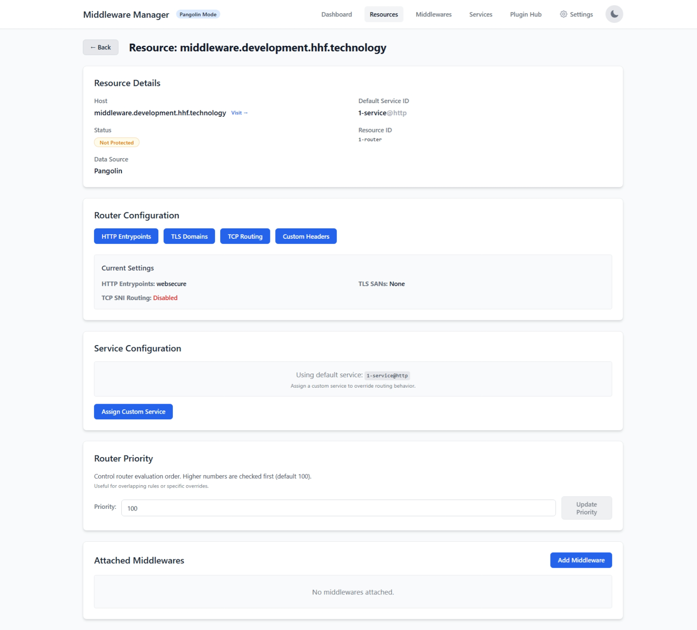  
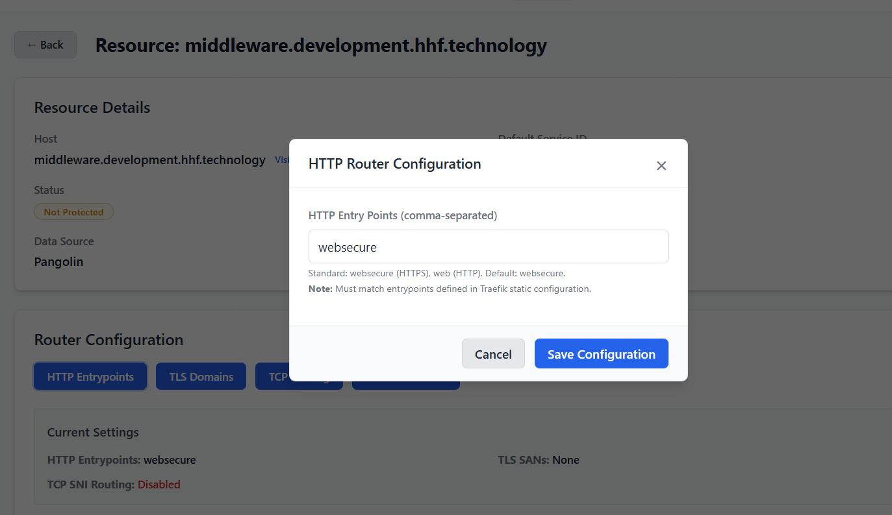
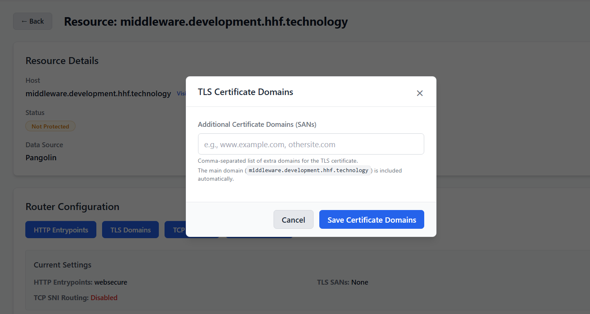
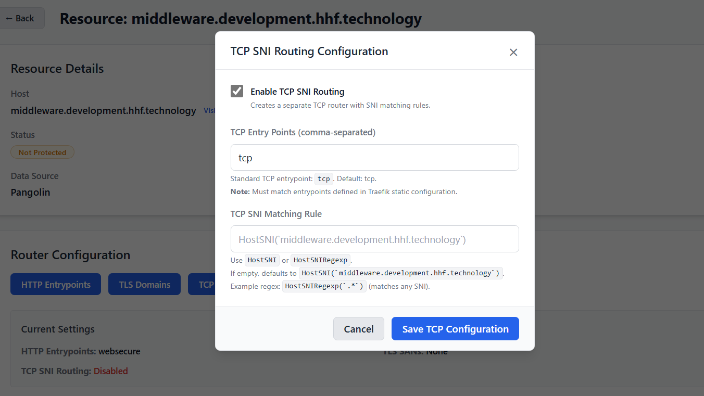
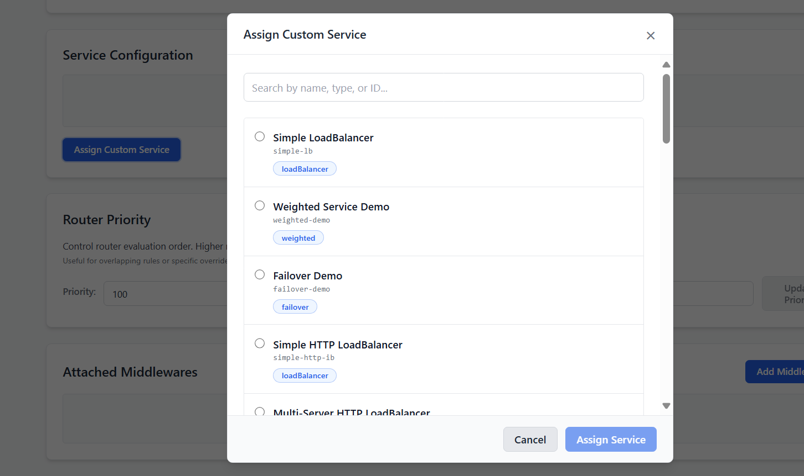
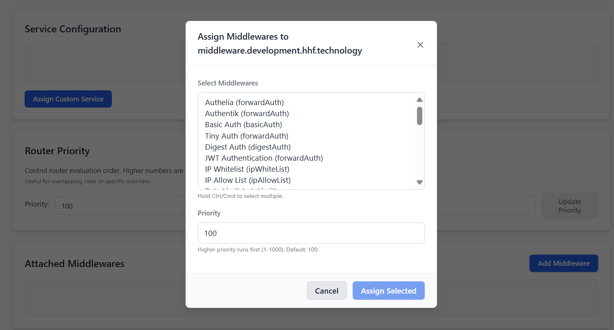
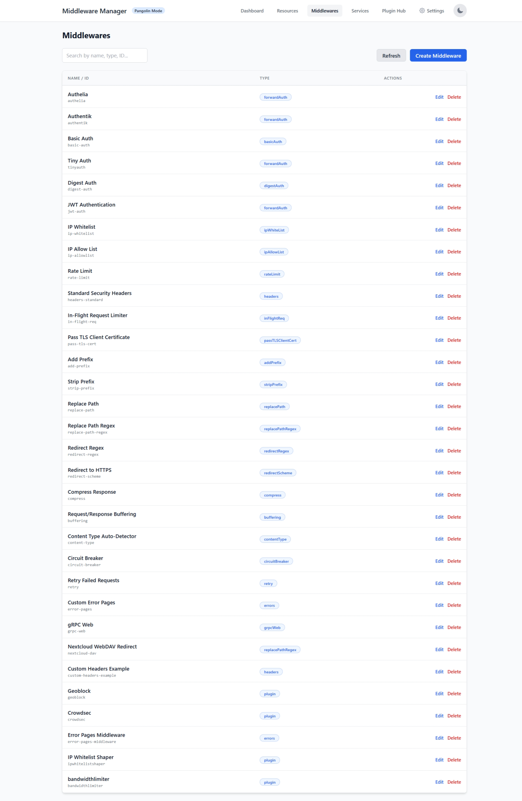
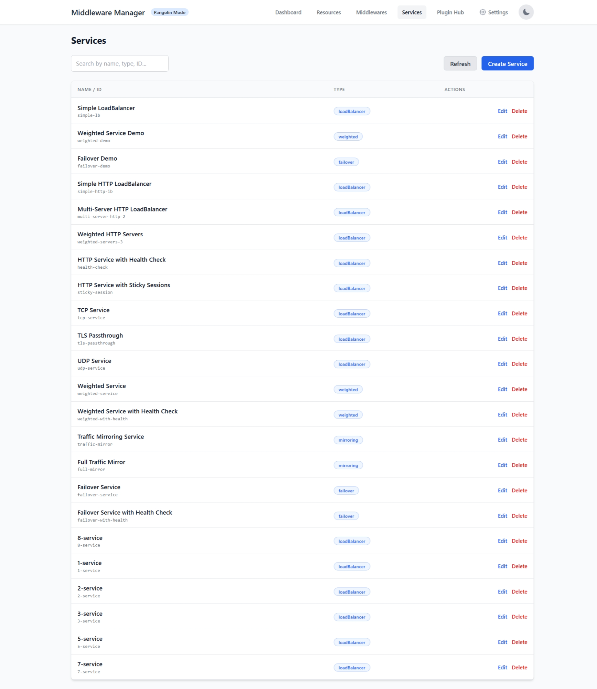
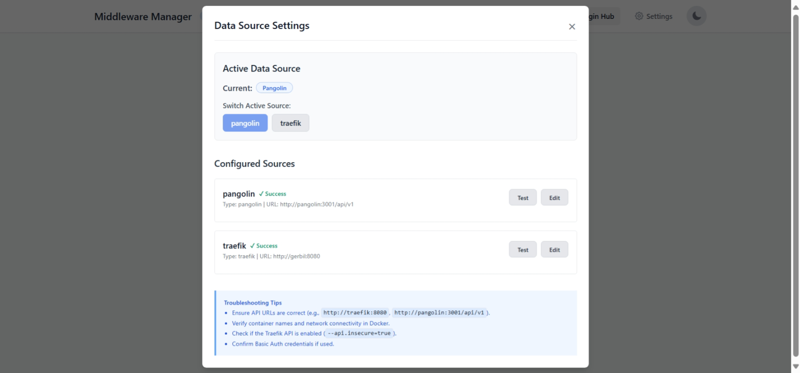

      
  </h5>
</div>

## Overview

Middleware Manager lets you attach Traefik middlewares, manage custom services, tune routers, and control plugins/mTLS from a single UI. It works with **Pangolin** or directly with **Traefik** as the data source and automatically generates Traefik dynamic configuration (e.g., `resource-overrides.yml`).

### Who this is for

*   Operators deploying with Pangolin or standalone Traefik.
*   Platform/SRE teams managing routers, services, plugins, and mTLS.
*   Contributors extending the Go API or React/Vite UI.

### What you can do

*   **Discover resources** from Pangolin or Traefik and override routers/services safely.
*   **Create and assign Traefik middlewares** with priorities and templates.
*   **Define custom services** (load balancer, weighted, mirroring, failover).
*   **Install/manage plugins** (writes to Traefik static config) and restart Traefik as needed.
*   **Enable mTLS** via the `mtlswhitelist` plugin with per-resource rules.
*   **Inspect Traefik routers/services/middlewares** via the built-in explorer.

---

## Quick Start Guide

### 1. Prerequisites

*   Traefik v2/v3 reachable from Middleware Manager.
*   Docker runtime for the provided containers.
*   Mount points for database and Traefik rules.

### 2. Choose Deployment Path

#### Option A: Deploy with Pangolin (Recommended)

Use this when Pangolin already manages Traefik and you want Middleware Manager to add middlewares, custom services, and plugin/mTLS control.

```yaml
middleware-manager:
  image: hhftechnology/middleware-manager:v3.0.0
  volumes:
    - ./data:/data
    - ./config/middleware-manager:/app/config
    - ./config/traefik:/etc/traefik         # Must match Traefik's static config dir
  environment:
    - ACTIVE_DATA_SOURCE=pangolin
    - PANGOLIN_API_URL=http://pangolin:3001/api/v1
    - TRAEFIK_STATIC_CONFIG_PATH=/etc/traefik/traefik_config.yml # Path inside container
    - TRAEFIK_CONF_DIR=/conf
    - DB_PATH=/data/middleware.db
    - PORT=3456
  ports:
    - "3456:3456"
```

#### Option B: Deploy with Traefik (Standalone)

Use this when Traefik is your only provider and you want Middleware Manager to own dynamic config and plugins/mTLS.

```yaml
middleware-manager:
  image: hhftechnology/middleware-manager:traefik-int
  volumes:
    - ./middleware_manager_data:/data
    - ./traefik_config/static:/etc/traefik  # Must match Traefik's static config dir
    - ./middleware_manager_config:/app/config
  environment:
    - ACTIVE_DATA_SOURCE=traefik
    - TRAEFIK_API_URL=http://traefik:8080
    - TRAEFIK_CONF_DIR=/conf
    - TRAEFIK_STATIC_CONFIG_PATH=/etc/traefik/traefik.yml
    - DB_PATH=/data/middleware.db
    - PORT=3456
  ports:
    - "3456:3456"
```

**Note:** Ensure `TRAEFIK_STATIC_CONFIG_PATH` points to the static file *inside the Middleware Manager container*. If the path is wrong, plugin install/removal will fail silently.

### 3. Configure Traefik Static Config

To allow Middleware Manager to dynamically update Traefik, you **must** configure the HTTP provider in your `traefik_config.yml` (or `traefik.yml`).

Replace any existing Pangolin endpoints with the Middleware Manager API endpoint:

```yaml
providers:
  http:
    endpoint: "http://middleware-manager:3456/api/v1/traefik-config"
    pollInterval: 5s
```

**Troubleshooting Connection:**
If the container name `middleware-manager` is not reachable (e.g., DNS issues), find the container's IP address:

```bash
docker inspect -f '{{range.NetworkSettings.Networks}}{{.IPAddress}}{{end}}' middleware-manager
```

Then use the IP in your config:
```yaml
endpoint: "http://172.17.1.3:3456/api/v1/traefik-config"
```

#### Full Example `traefik_config.yml`

<details>
<summary>Click to view full example config</summary>

```yaml
accessLog:
    bufferingSize: 100
    fields:
        defaultMode: drop
        headers:
            defaultMode: drop
            names:
                Authorization: redact
                Content-Type: keep
                Cookie: redact
                User-Agent: keep
                X-Forwarded-For: keep
                X-Forwarded-Proto: keep
                X-Real-Ip: keep
        names:
            ClientAddr: keep
            ClientHost: keep
            DownstreamContentSize: keep
            DownstreamStatus: keep
            Duration: keep
            RequestMethod: keep
            RequestPath: keep
            RequestProtocol: keep
            RetryAttempts: keep
            ServiceName: keep
            StartUTC: keep
            TLSCipher: keep
            TLSVersion: keep
    filePath: /var/log/traefik/access.log
    filters:
        minDuration: 100ms
        retryAttempts: true
        statusCodes:
            - 200-299
            - 400-499
            - 500-599
    format: json
api:
    dashboard: true
    insecure: true
certificatesResolvers:
    letsencrypt:
        acme:
            caServer: https://acme-v02.api.letsencrypt.org/directory
            email: your-email@hhf.technology
            httpChallenge:
                entryPoint: web
            storage: /letsencrypt/acme.json
entryPoints:
    tcp-51821:
        address: :51821/tcp
        http:
            middlewares:
                - crowdsec@file
            tls:
                certResolver: letsencrypt
        transport:
            respondingTimeouts:
                readTimeout: 30m
    udp-51830:
        address: :51830/udp
    web:
        address: :80
    websecure:
        address: :443
        http:
            tls:
                certResolver: letsencrypt
        transport:
            respondingTimeouts:
                readTimeout: 30m
experimental:
    plugins:
        badger:
            moduleName: github.com/fosrl/badger
            version: v1.2.0
        crowdsec:
            moduleName: github.com/maxlerebourg/crowdsec-bouncer-traefik-plugin
            version: v1.4.4
        mtlswhitelist:
            moduleName: github.com/smerschjohann/mtlswhitelist
            version: v0.3.0
log:
    compress: true
    filePath: /var/log/traefik/traefik.log
    format: json
    level: INFO
    maxAge: 3
    maxBackups: 3
    maxSize: 100
ping:
    entryPoint: web
providers:
    file:
        directory: /rules
        watch: true
    http:
        endpoint: http://172.17.1.3:3456/api/v1/traefik-config
        pollInterval: 5s
serversTransport:
    insecureSkipVerify: true
```
</details>

### 4. First Boot Checklist

1.  **Start the stack**: Run `docker compose up -d`.
2.  **Open the UI**: Navigate to `http://<host>:3456`.
3.  **Test Connection**: Go to **Settings → Test Connection** for the active data source.
4.  **Verify Dashboard**: Check that Routers/Services/Middlewares counts are loaded.
5.  **Explore**: Visit **Resources** and open any resource to confirm router details.

## Documentation

For full guides on configuration, security, operations, and API usage, please refer to the contents of the `docs` folder or the hosted documentation.

## Development

### Backend
```bash
go run main.go
# Build: go build -o middleware-manager main.go
```

### Frontend
```bash
cd ui
cp src/package.json .
npm install
npm start
```

## License

MIT License
